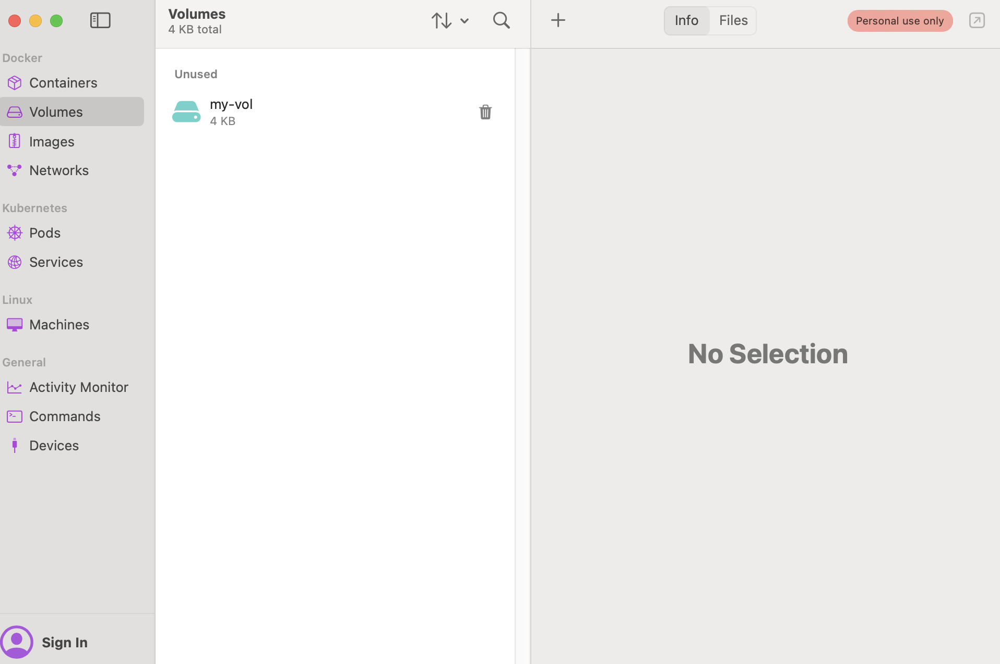
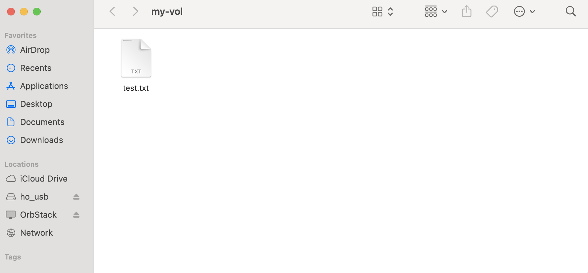
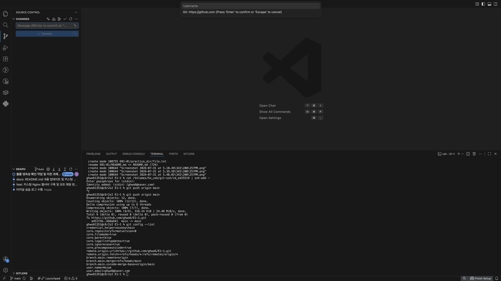

# 수행 항목 체크리스트
- [x] 터미널 기본 조작 연습
- [x] 파일 권한 변경 실습
- [x] Docker 기본 명령어
- [x] 간단한 웹서버 컨테이너 띄우기
- [x] ubuntu 컨테이너 내부 진입 실습
- [x] Dockerfile 커스텀 이미지 빌드
- [x] 포트 매핑 접속 검증
- [x] 바인드 마운트 반영 확인
- [x] Docker 볼륨 영속성 검증
- [x] Git 설정 + GitHub 연동

## 터미널 조작 로그 ( 터미널 기본 조작 연습 + 파일 권한 변경 실습)
~~~sh
Last login: Tue Jul 28 11:44:35 on ttys000
ghwo61351@c4r1s2 ~ % mkdir ~/ghwo6
ghwo61351@c4r1s2 ~ % cd ./ghwo6 
ghwo61351@c4r1s2 ghwo6 % git init                         
Initialized empty Git repository in /Users/ghwo61351/ghwo6/.git/
ghwo61351@c4r1s2 ghwo6 % git config --global user.name "Hojae"
ghwo61351@c4r1s2 ghwo6 % git config --global user.email "ghwo6@naver.com"
ghwo61351@c4r1s2 ghwo6 % git config --global init.defaultBranch main
ghwo61351@c4r1s2 ghwo6 % git config --list
credential.helper=osxkeychain
init.defaultbranch=main
user.name=Hojae
user.email=ghwo6@naver.com
init.defaultbranch=main
core.repositoryformatversion=0
core.filemode=true
core.bare=false
core.logallrefupdates=true
core.ignorecase=true
core.precomposeunicode=true
ghwo61351@c4r1s2 ghwo6 % 
ghwo61351@c4r1s2 ghwo6 % ls 
ghwo61351@c4r1s2 ghwo6 %                                           
ghwo61351@c4r1s2 ghwo6 % cd ~ 
ghwo61351@c4r1s2 ~ % ls
Applications	Downloads	Movies		Pictures
Desktop		ghwo6		Music		Public
Documents	Library		OrbStack
ghwo61351@c4r1s2 ~ % cd ./ghwo6 
ghwo61351@c4r1s2 ghwo6 % mkdir E01-01
ghwo61351@c4r1s2 ghwo6 % cd ./E01-01 
ghwo61351@c4r1s2 E01-01 % pwd
/Users/ghwo61351/ghwo6/E01-01
ghwo61351@c4r1s2 E01-01 % mkdir practice_dir
ghwo61351@c4r1s2 E01-01 % touch practice_dir/test.txt
ghwo61351@c4r1s2 E01-01 % ls ./practice_dir 
test.txt
ghwo61351@c4r1s2 E01-01 % cp practice_dir/test.txt practice_dir/copy.txt
ghwo61351@c4r1s2 E01-01 % mv practice_dir/copy.txt practice_dir/rename.txt
ghwo61351@c4r1s2 E01-01 % ls -la practice_dir 
total 0
drwxr-xr-x  4 ghwo61351  ghwo61351  128  7 28 12:43 .
drwxr-xr-x  3 ghwo61351  ghwo61351   96  7 28 12:42 ..
-rw-r--r--  1 ghwo61351  ghwo61351    0  7 28 12:43 rename.txt
-rw-r--r--  1 ghwo61351  ghwo61351    0  7 28 12:42 test.txt
ghwo61351@c4r1s2 E01-01 % ls -l practice_dir/test.txt
-rw-r--r--  1 ghwo61351  ghwo61351  0  7 28 12:42 practice_dir/test.txt
ghwo61351@c4r1s2 E01-01 % chmod 755 practice_dir/test.txt 
ghwo61351@c4r1s2 E01-01 % ls -l practice_dir/test.txt 
-rwxr-xr-x  1 ghwo61351  ghwo61351  0  7 28 12:42 practice_dir/test.txt
ghwo61351@c4r1s2 E01-01 % 
~~~

~~~sh
ghwo61351@c4r1s2 E01-01 % mkdir practice_dir
ghwo61351@c6r2s2 practice_dir % mkdir folder
ghwo61351@c6r2s2 practice_dir % touch file.txt
ghwo61351@c6r2s2 practice_dir % ls
file.txt        folder          rename.txt      test.txt
ghwo61351@c6r2s2 practice_dir % ls -al
total 0
drwxr-xr-x  6 ghwo61351  ghwo61351  192 Jul 31 16:34 .
drwxr-xr-x  3 ghwo61351  ghwo61351   96 Jul 31 16:29 ..
-rw-r--r--  1 ghwo61351  ghwo61351    0 Jul 31 16:34 file.txt
drwxr-xr-x  2 ghwo61351  ghwo61351   64 Jul 31 16:34 folder
-rw-r--r--  1 ghwo61351  ghwo61351    0 Jul 31 16:12 rename.txt
-rwxr-xr-x  1 ghwo61351  ghwo61351    0 Jul 31 16:12 test.txt
ghwo61351@c6r2s2 practice_dir % cat file.txt 
ghwo61351@c6r2s2 practice_dir % "file" >> ./file.txt 
Usage: file [-bcCdEhikLlNnprsSvzZ0] [--extension] [--mime-encoding]
            [--mime-type] [-e <testname>] [-F <separator>]  [-f <namefile>]
            [-m <magicfiles>] [-M magicfiles] [-P <parameter=value>] [--exclude-quiet]
            <file> ...
       file -C [-m <magicfiles>]
       file [--help]
Try `file --help' for more information.
ghwo61351@c6r2s2 practice_dir % 1234 >> ./file.txt 
zsh: command not found: 1234
ghwo61351@c6r2s2 practice_dir % echo "file" >> file.txt 
ghwo61351@c6r2s2 practice_dir % cat file.txt 
file
ghwo61351@c6r2s2 practice_dir % cd ./folder 
ghwo61351@c6r2s2 folder % cd ..
ghwo61351@c6r2s2 practice_dir % ls -al
total 8
drwxr-xr-x  6 ghwo61351  ghwo61351  192 Jul 31 16:34 .
drwxr-xr-x  3 ghwo61351  ghwo61351   96 Jul 31 16:29 ..
-rw-r--r--  1 ghwo61351  ghwo61351    5 Jul 31 16:37 file.txt
drwxr-xr-x  2 ghwo61351  ghwo61351   64 Jul 31 16:34 folder
-rw-r--r--  1 ghwo61351  ghwo61351    0 Jul 31 16:12 rename.txt
-rwxr-xr-x  1 ghwo61351  ghwo61351    0 Jul 31 16:12 test.txt
ghwo61351@c6r2s2 practice_dir % chmod 000 ./folder ./file.txt  
ghwo61351@c6r2s2 practice_dir % cd ./folder 
cd: permission denied: ./folder
ghwo61351@c6r2s2 practice_dir % cat file.txt 
cat: file.txt: Permission denied
ghwo61351@c6r2s2 practice_dir % chmod 777 ./folder ./file.txt 
ghwo61351@c6r2s2 practice_dir % cd ./folder                   
ghwo61351@c6r2s2 folder % cd ..
ghwo61351@c6r2s2 practice_dir % cat file.txt                  
file
ghwo61351@c6r2s2 practice_dir % 
~~~

## Docker 운영/검증 로그
~~~xsh
ghwo61351@c4r1s1 E1-1 % docker --version
Docker version 29.4.0, build 9d7ad9f
ghwo61351@c4r1s1 E1-1 % docker info
Client:
 Version:    29.4.0
 Context:    orbstack
 Debug Mode: false
 Plugins:
  buildx: Docker Buildx (Docker Inc.)
    Version:  v0.33.0
    Path:     /Users/ghwo61351/.docker/cli-plugins/docker-buildx
  compose: Docker Compose (Docker Inc.)
    Version:  v5.1.2
    Path:     /Users/ghwo61351/.docker/cli-plugins/docker-compose
Server:
 Containers: 0
  Running: 0
  Paused: 0
  Stopped: 0
 Images: 0
 Server Version: 29.4.0
 Storage Driver: overlayfs
  driver-type: io.containerd.snapshotter.v1
 Logging Driver: json-file
 Cgroup Driver: cgroupfs
 Cgroup Version: 2
 Plugins:
  Volume: local
  Network: bridge host ipvlan macvlan null overlay
  Log: awslogs fluentd gcplogs gelf journald json-file local splunk syslog
 CDI spec directories:
  /etc/cdi
  /var/run/cdi
 Swarm: inactive
 Runtimes: io.containerd.runc.v2 runc
 Default Runtime: runc
 Init Binary: docker-init
 containerd version: 77c84241c7cbdd9b4eca2591793e3d4f4317c590
 runc version: c241c0bb5e60a8e8c1b2e53d4eca8d0068d8d57e
 init version: de40ad0
 Security Options:
  seccomp
   Profile: builtin
  cgroupns
 Kernel Version: 6.19.13-orbstack-gbd1dc07b8cf4
 Operating System: OrbStack
 OSType: linux
 Architecture: x86_64
 CPUs: 6
 Total Memory: 15.67GiB
 Name: orbstack
 ID: 8d1e589c-22e2-4dcc-964c-b0212b39607b
 Docker Root Dir: /var/lib/docker
 Debug Mode: false
 Experimental: false
 Insecure Registries:
  ::1/128
  127.0.0.0/8
 Live Restore Enabled: false
 Product License: Community Engine
 Default Address Pools:
   Base: 192.168.97.0/24, Size: 24
   Base: 192.168.107.0/24, Size: 24
   Base: 192.168.117.0/24, Size: 24
   Base: 192.168.147.0/24, Size: 24
   Base: 192.168.148.0/24, Size: 24
   Base: 192.168.155.0/24, Size: 24
   Base: 192.168.156.0/24, Size: 24
   Base: 192.168.158.0/24, Size: 24
   Base: 192.168.163.0/24, Size: 24
   Base: 192.168.164.0/24, Size: 24
   Base: 192.168.165.0/24, Size: 24
   Base: 192.168.166.0/24, Size: 24
   Base: 192.168.167.0/24, Size: 24
   Base: 192.168.171.0/24, Size: 24
   Base: 192.168.172.0/24, Size: 24
   Base: 192.168.181.0/24, Size: 24
   Base: 192.168.183.0/24, Size: 24
   Base: 192.168.186.0/24, Size: 24
   Base: 192.168.207.0/24, Size: 24
   Base: 192.168.214.0/24, Size: 24
   Base: 192.168.215.0/24, Size: 24
   Base: 192.168.216.0/24, Size: 24
   Base: 192.168.223.0/24, Size: 24
   Base: 192.168.227.0/24, Size: 24
   Base: 192.168.228.0/24, Size: 24
   Base: 192.168.229.0/24, Size: 24
   Base: 192.168.237.0/24, Size: 24
   Base: 192.168.239.0/24, Size: 24
   Base: 192.168.242.0/24, Size: 24
   Base: 192.168.247.0/24, Size: 24
   Base: fd07:b51a:cc66:d000::/56, Size: 64
 Firewall Backend: iptables
WARNING: DOCKER_INSECURE_NO_IPTABLES_RAW is set
ghwo61351@c4r1s1 E1-1 % docker run hello-world
Unable to find image 'hello-world:latest' locally
latest: Pulling from library/hello-world
4f55086f7dd0: Pull complete 
d5e71e642bf5: Download complete 
Digest: sha256:c3cbe1cc1aa588a64951ac6286e0df7b27fe2e6324b1001c619bb358770c0178
Status: Downloaded newer image for hello-world:latest
Hello from Docker!
This message shows that your installation appears to be working correctly.
To generate this message, Docker took the following steps:
 1. The Docker client contacted the Docker daemon.
 2. The Docker daemon pulled the "hello-world" image from the Docker Hub.
    (amd64)
 3. The Docker daemon created a new container from that image which runs the
    executable that produces the output you are currently reading.
 4. The Docker daemon streamed that output to the Docker client, which sent it
    to your terminal.
To try something more ambitious, you can run an Ubuntu container with:
 $ docker run -it ubuntu bash
Share images, automate workflows, and more with a free Docker ID:
 https://hub.docker.com/
For more examples and ideas, visit:
 https://docs.docker.com/get-started/
ghwo61351@c4r1s1 E1-1 % docker run -it ubuntu bash
Unable to find image 'ubuntu:latest' locally
latest: Pulling from library/ubuntu
ed819469700f: Pull complete 
a3679419df18: Pull complete 
e16351a257e4: Download complete 
Digest: sha256:3131b4cc82a783df6c9df078f86e01819a13594b865c2cad47bd1bca2b7063bb
Status: Downloaded newer image for ubuntu:latest
root@474b1b2da4c2:/# ls
bin   dev  home  lib64  mnt  proc  run   srv  tmp  var
boot  etc  lib   media  opt  root  sbin  sys  usr
root@474b1b2da4c2:/# ls -la
total 16
drwxr-xr-x   1 root root   6 Jul 29 07:09 .
drwxr-xr-x   1 root root   6 Jul 29 07:09 ..
-rwxr-xr-x   1 root root   0 Jul 29 07:09 .dockerenv
drwxr-xr-x   1 root root  26 Jul 13 16:06 .rock
lrwxrwxrwx   1 root root   7 Apr 20 08:46 bin -> usr/bin
drwxr-xr-x   1 root root   0 Apr 20 08:46 boot
drwxr-xr-x   5 root root 340 Jul 29 07:09 dev
drwxr-xr-x   1 root root  56 Jul 29 07:09 etc
drwxr-xr-x   1 root root  12 Jul 13 16:06 home
lrwxrwxrwx   1 root root   7 Apr 20 08:46 lib -> usr/lib
lrwxrwxrwx   1 root root   9 Apr 20 08:46 lib64 -> usr/lib64
drwxr-xr-x   1 root root   0 Jul 13 16:05 media
drwxr-xr-x   1 root root   0 Jul 13 16:05 mnt
drwxr-xr-x   1 root root   0 Jul 13 16:05 opt
dr-xr-xr-x 234 root root   0 Jul 29 07:09 proc
drwx------   1 root root  30 Jul 13 16:06 root
drwxr-xr-x   1 root root  22 Jul 13 16:06 run
lrwxrwxrwx   1 root root   8 Apr 20 08:46 sbin -> usr/sbin
drwxr-xr-x   1 root root   0 Jul 13 16:05 srv
dr-xr-xr-x  11 root root   0 Jul 29 07:09 sys
drwxrwxrwt   1 root root   0 Jul 13 16:06 tmp
drwxr-xr-x   1 root root  10 Jul 13 16:05 usr
drwxr-xr-x   1 root root  90 Jul 13 16:06 var
root@474b1b2da4c2:/# echo $SHELL 
/bin/bash
root@474b1b2da4c2:/# exit
exit
ghwo61351@c4r1s1 E1-1 % 
ghwo61351@c4r1s1 E1-1 % mkdir app   
ghwo61351@c4r1s1 E1-1 % echo "<h1>Hello Codyssey! Built by Hojae</h1>" > app/index.html
ghwo61351@c4r1s1 E1-1 % mkdir docker
ghwo61351@c4r1s1 E1-1 % mv ./app ./docker/app
ghwo61351@c4r1s1 E1-1 % ls docker
app
ghwo61351@c4r1s1 E1-1 % cd docker 
ghwo61351@c4r1s1 docker % nano Dockerfile
ghwo61351@c4r1s1 docker % docker build -t my-web:1.0 .
[+] Building 8.0s (7/7) FINISHED                         docker:orbstack
 => [internal] load build definition from Dockerfile                0.2s
 => => transferring dockerfile: 118B                                0.0s
 => [internal] load metadata for docker.io/library/nginx:alpine     2.6s
 => [internal] load .dockerignore                                   0.2s
 => => transferring context: 2B                                     0.0s
 => [internal] load build context                                   0.3s
 => => transferring context: 108B                                   0.0s
 => [1/2] FROM docker.io/library/nginx:alpine@sha256:4a73073bd557c  3.3s
 => => resolve docker.io/library/nginx:alpine@sha256:4a73073bd557c  0.2s
 => => sha256:46519e7231d2eb5604df229beb44d59719 20.31MB / 20.31MB  0.5s
 => => sha256:390dc935348d8070e695fbaae2a4bb114fb9 1.40kB / 1.40kB  0.5s
 => => sha256:d0008c891db48b5f526d914bce9e8d889fe1 1.21kB / 1.21kB  0.6s
 => => sha256:46f977ee452f4399c208714afa034868d6056864 404B / 404B  0.6s
 => => sha256:62bec68d7c31c4c8a19d812d84da5f7748e54690 957B / 957B  0.2s
 => => sha256:1223f016b4e4a2c21f7c49d4837fbfd47a9da643 627B / 627B  0.3s
 => => sha256:55afa1ecc21d2bb5e5045f32dafee56272ff 3.85MB / 3.85MB  0.3s
 => => sha256:3cd534fe98c64d68a1f4f1c83abb8d5cba7ecfd7 0B / 1.89MB  3.2s
 => => extracting sha256:55afa1ecc21d2bb5e5045f32dafee56272ffd8986  0.2s
 => => extracting sha256:3cd534fe98c64d68a1f4f1c83abb8d5cba7ecfd7b  0.2s
 => => extracting sha256:1223f016b4e4a2c21f7c49d4837fbfd47a9da6436  0.1s
 => => extracting sha256:62bec68d7c31c4c8a19d812d84da5f7748e54690c  0.1s
 => => extracting sha256:46f977ee452f4399c208714afa034868d6056864f  0.1s
 => => extracting sha256:d0008c891db48b5f526d914bce9e8d889fe1a9d1f  0.1s
 => => extracting sha256:390dc935348d8070e695fbaae2a4bb114fb9e69c5  0.1s
 => => extracting sha256:46519e7231d2eb5604df229beb44d59719a489eaa  0.4s
 => [2/2] COPY app/index.html /usr/share/nginx/html/index.html      0.3s
 => exporting to image                                              0.9s
 => => exporting layers                                             0.4s
 => => exporting manifest sha256:c2dcc3ae151af6f40351034f8fd2c76c3  0.0s
 => => exporting config sha256:d94b729fb8b3c1d8ac8ca9a321deb57b7ca  0.1s
 => => exporting attestation manifest sha256:8cc3100650f7855c701ef  0.1s
 => => exporting manifest list sha256:2b057a3f94ce1df8e9a4d78c5d5d  0.1s
 => => naming to docker.io/library/my-web:1.0                       0.0s
 => => unpacking to docker.io/library/my-web:1.0                    0.1s
ghwo61351@c4r1s1 docker % docker run -d -p 8080:80 --name my-custom-server my-web:1.0
d7fc18efe4af8ca4d3b50b7e1440ca13d39ac972641db1e78857d059635e3f9a
ghwo61351@c4r1s1 docker % docker images
                                                     i Info →   U  In Use
IMAGE                ID             DISK USAGE   CONTENT SIZE   EXTRA
hello-world:latest   c3cbe1cc1aa5       21.8kB         9.49kB    U   
my-web:1.0           2b057a3f94ce       93.9MB         26.1MB    U   
ubuntu:latest        3131b4cc82a7        159MB         45.3MB    U   
ghwo61351@c4r1s1 docker % docker ps -a
CONTAINER ID   IMAGE         COMMAND                  CREATED              STATUS                      PORTS                                     NAMES
d7fc18efe4af   my-web:1.0    "/docker-entrypoint.…"   About a minute ago   Up About a minute           0.0.0.0:8080->80/tcp, [::]:8080->80/tcp   my-custom-server
474b1b2da4c2   ubuntu        "bash"                   28 minutes ago       Exited (0) 27 minutes ago                                             distracted_hypatia
95fc826881ef   hello-world   "/hello"                 28 minutes ago       Exited (0) 28 minutes ago                                             adoring_chaplygin
ghwo61351@c4r1s1 docker % docker logs my-custom-server
/docker-entrypoint.sh: /docker-entrypoint.d/ is not empty, will attempt to perform configuration
/docker-entrypoint.sh: Looking for shell scripts in /docker-entrypoint.d/
/docker-entrypoint.sh: Launching /docker-entrypoint.d/10-listen-on-ipv6-by-default.sh
10-listen-on-ipv6-by-default.sh: info: Getting the checksum of /etc/nginx/conf.d/default.conf
10-listen-on-ipv6-by-default.sh: info: Enabled listen on IPv6 in /etc/nginx/conf.d/default.conf
/docker-entrypoint.sh: Sourcing /docker-entrypoint.d/15-local-resolvers.envsh
/docker-entrypoint.sh: Launching /docker-entrypoint.d/20-envsubst-on-templates.sh
/docker-entrypoint.sh: Launching /docker-entrypoint.d/30-tune-worker-processes.sh
/docker-entrypoint.sh: Configuration complete; ready for start up
2026/07/29 07:35:54 [notice] 1#1: using the "epoll" event method
2026/07/29 07:35:54 [notice] 1#1: nginx/1.31.3
2026/07/29 07:35:54 [notice] 1#1: built by gcc 15.2.0 (Alpine 15.2.0) 
2026/07/29 07:35:54 [notice] 1#1: OS: Linux 6.19.13-orbstack-gbd1dc07b8cf4
2026/07/29 07:35:54 [notice] 1#1: getrlimit(RLIMIT_NOFILE): 20480:1048576
2026/07/29 07:35:54 [notice] 1#1: start worker processes
2026/07/29 07:35:54 [notice] 1#1: start worker process 30
2026/07/29 07:35:54 [notice] 1#1: start worker process 31
2026/07/29 07:35:54 [notice] 1#1: start worker process 32
2026/07/29 07:35:54 [notice] 1#1: start worker process 33
2026/07/29 07:35:54 [notice] 1#1: start worker process 34
2026/07/29 07:35:54 [notice] 1#1: start worker process 35
ghwo61351@c4r1s1 docker % docker stats --no-stream my-custom-server
CONTAINER ID   NAME               CPU %     MEM USAGE / LIMIT    MEM %     NET I/O         BLOCK I/O         PIDS
d7fc18efe4af   my-custom-server   0.00%     6.16MiB / 15.67GiB   0.04%     1.13kB / 126B   10.3MB / 8.19kB   7
ghwo61351@c4r1s1 docker % curl localhost:8080
<h1>Hello Codyssey! Built by Hojae</h1>
ghwo61351@c4r1s1 docker % 
~~~

## 볼륨 영속성 확인
~~~sh
ghwo61351@c6r2s2 E1-1 % docker volume --help
Usage:  docker volume COMMAND

Manage volumes

Commands:
  create      Create a volume
  inspect     Display detailed information on one or more volumes
  ls          List volumes
  prune       Remove unused local volumes
  rm          Remove one or more volumes

Run 'docker volume COMMAND --help' for more information on a command.
ghwo61351@c6r2s2 E1-1 % docker volume create my-vol
my-vol
ghwo61351@c6r2s2 E1-1 % docker volume ls
DRIVER    VOLUME NAME
local     my-vol
ghwo61351@c6r2s2 E1-1 % docker volume inspect my-vol
[
    {
        "CreatedAt": "2026-07-31T17:28:26+09:00",
        "Driver": "local",
        "Labels": null,
        "Mountpoint": "/var/lib/docker/volumes/my-vol/_data",
        "Name": "my-vol",
        "Options": null,
        "Scope": "local"
    }
]
ghwo61351@c6r2s2 E1-1 % docker run -it --name vol-test-1 -v my-vol:/data ubuntu bash
root@72d5f3701a89:/# echo "Data Persistence Test - Built by Hojae" > /data/test.txt
root@72d5f3701a89:/# ls  
bin  boot  data  dev  etc  home  lib  lib64  media  mnt  opt  proc  root  run  sbin  srv  sys  tmp  usr  var
root@72d5f3701a89:/# ls /data
test.txt
root@72d5f3701a89:/# cat /data/test.txt 
Data Persistence Test - Built by Hojae
root@72d5f3701a89:/# exit
exit
ghwo61351@c6r2s2 E1-1 % docker rm -f vol-test-1
vol-test-1
ghwo61351@c6r2s2 E1-1 % docker run -it --name vol-test-2 -v my-vol:/data ubuntu bash
root@b1584b9b5156:/# ls /data 
test.txt
root@b1584b9b5156:/# cat /data/test.txt 
Data Persistence Test - Built by Hojae
root@b1584b9b5156:/# exit
exit
ghwo61351@c6r2s2 E1-1 % docker rm -f vol-test-2
vol-test-2
ghwo61351@c6r2s2 E1-1 % docker volume inspect my-vol
[
    {
        "CreatedAt": "2026-07-31T17:28:26+09:00",
        "Driver": "local",
        "Labels": null,
        "Mountpoint": "/var/lib/docker/volumes/my-vol/_data",
        "Name": "my-vol",
        "Options": null,
        "Scope": "local"
    }
]
ghwo61351@c6r2s2 E1-1 % 
~~~

## ssh key
~~~sh
ghwo61351@c5r1s2 ~ % ls /Volumes 
Macintosh HD
ghwo61351@c5r1s2 ~ % Disk Utility
zsh: command not found: Disk
ghwo61351@c5r1s2 ~ % ls /Volumes 
ho_usb		Macintosh HD
ghwo61351@c5r1s2 ~ % mkdir /Volumes/ho_usb/git-ssh
mkdir: /Volumes/ho_usb/git-ssh: File exists
ghwo61351@c5r1s2 ~ % ssh-keygen -t ed25519 -C "ghwo6@naver.com" -f /Volumes/ho_usb/git-ssh/id_ed25519
Generating public/private ed25519 key pair.
Enter passphrase for "/Volumes/ho_usb/git-ssh/id_ed25519" (empty for no passphrase): 
Enter same passphrase again: 
Your identification has been saved in /Volumes/ho_usb/git-ssh/id_ed25519
Your public key has been saved in /Volumes/ho_usb/git-ssh/id_ed25519.pub
The key fingerprint is:
SHA256:
The key's randomart image is:
+--[ED25519 256]--+
|                 |
|       .       . |
|      . o .   . .|
|     . + = . .  o|
|    o o S = .  .o|
| . o . + *     ..|
|  o =o+.% =     E|
|   o.+=X+%       |
|    .oOB+oo      |
+----[SHA256]-----+
ghwo61351@c5r1s2 ~ % cat /Volumes/ho_usb/git-ssh/id_ed25519.pub | pbcopy
ghwo61351@c5r1s2 ~ % 
‘’’

## git-ssh 설정함
~~~sh
ghwo61351@c6r2s2 E1-1 % git push origin main --force
The authenticity of host 'github.com (20.200.245.247)' can't be established.
ED25519 key fingerprint is SHA256:+xxxxxx/zxxxxxx.
This key is not known by any other names.
Are you sure you want to continue connecting (yes/no/[fingerprint])? yes
Warning: Permanently added 'github.com' (ED25519) to the list of known hosts.
Total 0 (delta 0), reused 0 (delta 0), pack-reused 0 (from 0)
To github.com:ghwo6/E1-1.git
 + eda1300...a4xxb8 main -> main (forced update)
~~~
